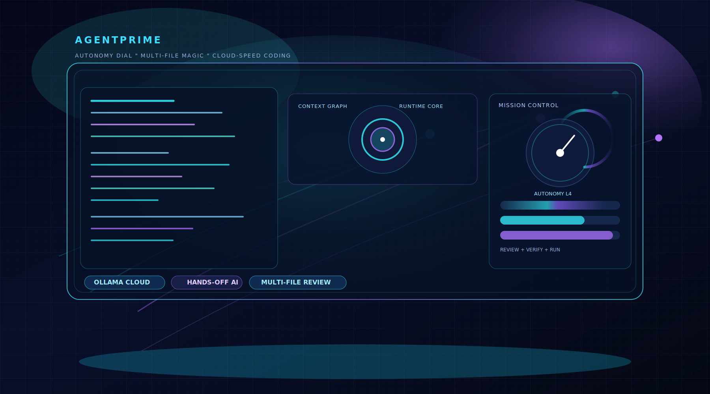

<p align="center">
  
</p>

<h1 align="center">AgentPrime</h1>

<p align="center">
  Cloud-ready, local-capable AI coding workspace for desktop.
</p>

<p align="center">
  <strong>Now shipping:</strong> Agent autonomy dial, staged multi-file review controls, and faster semantic indexing at scale.
</p>

<p align="center">
  Built with Electron, React, TypeScript, Monaco, and an optional Python "Brain" backend.
</p>

<p align="center">
  Owned and maintained by <a href="https://BostonAI.io">BostonAI.io</a>.
</p>

## Overview

AgentPrime is a desktop IDE designed to keep AI assistance close to the real coding workflow instead of turning the product into a generic chat shell.

It combines:

- A lean Electron desktop app with workspace, tabs, file tree, terminal, search, settings, and command palette
- AI chat, agent execution, inline edit, and model routing across multiple providers
- Template-based project starts, Git-aware workflows, live preview, and deployment helpers
- Secure renderer-to-main IPC with a preload bridge and desktop-first privacy defaults

The goal is simple: give you a practical local coding environment that feels fast, workspace-aware, and useful from the first launch.

## Project Status

AgentPrime is in an active foundation-hardening phase: the desktop IDE shell is already real, but the main push right now is turning project creation and agent execution from "alpha-feeling" into a dependable loop.

Current status:

- The desktop product shell is in place: workspace, Monaco editor, tabs, terminal, search, settings, chat, and model routing all exist.
- The agent system is moving from prompt-only specialists to bounded discipline experts with file ownership, tool limits, command limits, and blackboard-style handoffs.
- Template creation is now being hardened around a single materialization path instead of multiple drifting creation flows.
- The current target loop is `create -> review -> apply -> install -> run -> repair`.

Recently verified:

- Transactional template materialization with rollback support for failed project generation.
- Deterministic scaffold routing for canonical template requests like `threejs-game`.
- Specialist planning and blackboard state for bounded assignments and repair passes.
- Specialist-aware tool validation for file, tool, and command boundaries.
- Rollback-aware verification messaging and targeted repair behavior.
- End-to-end `threejs-game` smoke coverage for `create -> npm install -> npm run build`.

Confidence snapshot:

- `31/31` targeted regression tests passing for the scaffold, specialist, validation, and verification workstreams.
- Lightweight Three.js routing smoke passing.
- Filtered template smoke passing for the `threejs-game` template.

This is not the finish line yet, but it is a meaningful step past the earlier "alpha" behavior in project generation and specialist coordination.

## What AgentPrime Can Do

- Open a project and work in a full desktop IDE shell with Monaco editor, tabs, file tree, terminal, and search/replace
- Talk to AI in chat mode or let the agent operate on a workspace with file context, open tabs, and terminal history
- Route requests through fast, deep, or auto model selection
- Use multiple providers without locking the app to a single vendor
- Run specialized agents for more structured multi-step work
- Tune Agent Mode from guided to hands-off with runtime guardrails for tools, commands, and file writes
- Review streamed agent progress and capture file changes for review
- Apply inline AI edits directly from the editor
- Use ghost text completions and contextual coding assistance
- Run natural-language file operations (including one-shot folder organization) with confirmation prompts before bulk moves
- Generate projects from built-in templates
- Preview and deploy projects from inside the app
- Work with Git actions and VibeHub-style repository workflows

## Recent Upgrades

### Agent & validation fixes (April 2026)

- **Glob matching (`tool-validation.ts`):** `**` in patterns like `src/**/*.tsx` / `src/**/*.css` now matches files directly under `src/` (e.g. `src/App.tsx`, `src/index.css`). The previous regex incorrectly required an extra path segment and caused false “outside writable scope” rejections for specialists.
- **Specialist writable scopes (`specialist-contracts.ts`):** `javascript_specialist` may write `src/**/*.css` and root `README.md` when co-wiring Vite/React entrypoints; `pipeline_specialist` includes `README.md`, `*.bat`, `Makefile`, and `Dockerfile*` alongside existing manifest/config globs. Pipeline and mirror prompts clarify that pipeline must not rewrite application source under `src/`.
- **Task Master claims (`task-master.ts`):** Per-step `claimedFiles` for `javascript_specialist` and `pipeline_specialist` are aligned with those scopes (including `src/**/*.css` and `README.md`). This fixes tool calls that passed writable globs but failed with **“outside assigned file claims”** during multi-specialist runs.
- **Plugin sandbox (`plugin-sandbox.ts`):** Replaced dynamic `require(moduleId)` with static requires for allowed Node built-ins so webpack no longer emits “Critical dependency: the request of a dependency is an expression” on the main bundle.
- **Tests:** Extended `tests/agent/tool-validation-specialists.test.ts` and `tests/agent/task-master-plan.test.ts` for the above behavior.

- **TypeScript config & bundler-aware JS checks (`tool-validation.ts`):** `tsconfig.json` is validated with the TypeScript compiler API so unknown or malformed options surface before build. JavaScript validation treats Vite/webpack-style projects as bundler-backed and avoids noisy warnings for normal `import './index.css'` entry wiring. Duplicate game-module paths (e.g. parallel `src/game/World.ts` and `src/game/world/World.ts`) are flagged to reduce import drift.
- **Styling specialist prompts (`specialized-agents.ts`):** `workspacePath` is passed into JS validation so bundler detection matches the real project. Prompts and mirror guidance stress that styling must not edit gameplay under `src/game/**` or documentation like `README.md`.
- **Retry loop & verification logs (`specialized-agent-loop.ts`):** On repair retries, `styling_ux_specialist` and `integration_analyst` are skipped when the failure pattern is not in their lane (fewer wasted tokens and fewer out-of-scope tool attempts). The early structural check is logged as “Structural verification passed (pre-install/build/runtime checks)” so it is not confused with a full `npm run build` pass. Long command output in errors keeps both head and tail for context.
- **Repair specialist claims (`task-master.ts`):** Repair steps include a baseline claim set (`src/**`, manifests, configs, `README.md`, etc.) alongside `retryFiles`, so fix passes are not rejected as “outside assigned file claims” when the model needs to touch several project files.

### Memory, security, and agent hardening (April 2026)

This batch tightens long-term memory, auth, logging, startup reliability, UI feedback, validation, and specialist boundaries so create → verify → repair behaves more predictably.

- **Long-term memory (`backend/app/core/memory.py`):** Optional semantic retrieval using SentenceTransformers (`all-MiniLM-L6-v2`) with cosine similarity over stored embeddings; TF-IDF remains when embeddings are disabled or unavailable. Python deps include `sentence-transformers`, `numpy`, and `httpx>=0.27` (compatible with `ollama`).
- **Prompt injection mitigation:** `src/main/security/prompt-sanitizer.ts` detects and neutralizes risky user text; wired into `src/main/agent-loop.ts` and `src/main/agent/specialized-agent-loop.ts` before messages drive tools.
- **Enterprise password verification:** `src/main/security/enterprise-security.ts` verifies passwords against stored material with SHA-256 and `crypto.timingSafeEqual` (removes the previous always-true placeholder).
- **Structured logging:** `src/main/core/logger.ts` provides leveled logging; set `AGENTPRIME_LOG_LEVEL` to `debug`, `info`, `warn`, or `error`. Used in high-traffic paths such as the brain IPC handler, backend manager, and specialized agent loop.
- **Renderer short-term memory:** `src/renderer/agent/shortTermMemory.ts` runs a periodic cleanup timer so LRU entries do not linger past TTL. Covered by `tests/renderer/shortTermMemory.test.ts`.
- **Mirror and specialist prompts:** `src/main/agent/specialized-agents.ts` caches mirror context per task and limits full Opus example injection to the initial planning pass; later specialists get short summaries to save tokens. Mirror is enabled by default in `src/main/core/feature-flags.ts` (still overridable by env).
- **Brain HTTP client and backend startup:** `src/main/ipc-handlers/brain-handler.ts` waits for the FastAPI brain with exponential backoff instead of spamming connection errors. `src/main/core/backend-manager.ts` uses backoff when probing readiness during backend start.
- **Chat UI:** `src/renderer/components/AIChat/components/ChatHeader.tsx` shows a **Brain offline** state when the Python backend is not connected; styles in `src/renderer/vibe-styles.css`.
- **Package manifest validation:** `src/main/agent/tool-validation.ts` rejects obviously invalid npm dependency major versions for common packages before writes, reducing `npm install` failures from hallucinated versions.
- **Production builds from the runner:** `src/main/agent/tools/projectRunner.ts` sets `NODE_ENV=production` for `runBuild` so frameworks like Next.js receive the correct build mode (dev env is still used for install/dev run paths as before).
- **Specialist writable scopes:** `src/main/agent/specialist-contracts.ts` extends templates and specialists for modern app layouts (`app/`, `pages/`, `lib/`, `components/`), env and root configs (`.env`, `.env.local`, `next.config.*`, Tailwind/PostCSS, shared `*.config.*`), and gives `repair_specialist` bounded `run_command` allowances (`npm install`, `npm run`, `npx`, `node`) so repair passes can fix manifests and configs without false “outside writable scope” errors.
- **Smart task router:** `src/renderer/agent/smartRouter.ts` caches recent task analyses (up to 100 entries) to avoid redundant routing work for similar prompts.
- **Tests added or extended:** `tests/security/prompt-sanitizer.test.ts`, `tests/core/logger.test.ts`, `tests/renderer/shortTermMemory.test.ts`, and package-json validation coverage in `tests/tool-validation.test.ts`.

### Scaffold contracts & build-retry routing (`specialized-agents.ts`, `specialized-agent-loop.ts`)

- When a template is already on disk, orchestrator and specialist prompts include stronger scaffold context (key gameplay files like `Entity.ts`, `Player.ts`, `Controls.ts`, nested `world/World.ts`) plus explicit rules: do not invent parallel paths (e.g. `src/game/World.ts` vs `src/game/world/World.ts`), and keep subclass method signatures and call-site APIs consistent across files. On **build-heavy** verification retries (`[build]`, TypeScript errors), `tool_orchestrator` is skipped so the pass focuses on repair instead of re-orchestrating the whole project.
- **Tests:** `tests/specialized-agent-loop.test.ts` asserts build-heavy retries drop `tool_orchestrator` and `integration_analyst` from the active role set.

- Added a typed bounded-specialist contract matrix with discipline metadata and reflection checklists in `src/main/agent/specialist-contracts.ts`.
- Added blackboard ownership tracking and bounded step planning through `src/main/agent/task-master.ts` and `src/main/agent/specialized-agent-loop.ts`.
- Hardened `src/main/legacy/template-engine.ts` so failed template generation can roll back cleanly instead of leaving partial projects behind.
- Added deterministic scaffold routing and bootstrap coverage for browser Three.js projects.
- Added specialist-boundary regression tests, template rollback tests, and smoke validation for the current create path.
- Better AI Composer stability. Once the composer has been opened, it stays mounted when collapsed so in-flight work is not reset.
- Faster, richer chat rendering with a virtualized message list and improved code blocks with copy/apply actions.
- Safer chat payload handling through schema-validated IPC context with stricter bounds on incoming data.
- Faster workspace source discovery with new glob-based helpers for agent context, verification, and indexing.
- Better specialized-agent execution with bounded parallel tool work and stronger review/verification plumbing.
- Improved Ollama handling so cloud-style endpoints do not get treated like a local daemon health check path.
- Shortcut behavior aligned with the UI: `Ctrl+K` opens the command palette outside the editor, while `Ctrl+K` in Monaco remains inline AI edit.
- Added a model capability estimator for the chat status bar so the active-model "Power" meter updates from model IDs (size and named frontier tiers).
- Switched default dual-model routing in chat to Ollama cloud-first models (`devstral-small-2:24b-cloud` fast, `qwen3-coder-next:cloud` deep).
- Raised default Ollama cloud `agent` and `words_to_code` token budgets to `32768` and added regression coverage.
- Added focused renderer tests for model capability scoring and stabilized the e2e agent-mode input path.
- Ignored transient local artifacts (`playwright-report/`, `test-results/`, `build_output.txt`, `tsc_output.txt`) for cleaner commit hygiene.
- Added an Agent Autonomy dial in settings/composer and enforced backend autonomy policies for tool calls, command usage, and file-write limits.
- Upgraded staged multi-file review with file search, status filters, expand/collapse visible controls, and per-file diff impact badges.
- Improved semantic indexing reliability by reusing the shared workspace indexer and handling in-flight indexing requests more predictably.
- Refreshed the README hero artwork for a stronger AgentPrime visual identity.
- Added a dedicated organize intent in the command pipeline so prompts like `organize my downloads folder` route to file operations (with safety confirmation) instead of coding mode.

## Next Goals

The next major milestones are focused on making AgentPrime feel like a proper AI IDE instead of a promising prototype:

1. Add user-visible review/apply checkpoints so generated patch sets can be staged before writes are finalized.
2. Split reflection into `instant`, `standard`, and `deep` budgets so specialists stay fast on easy turns and only escalate on risky or failing work.
3. Expand smoke coverage from the current scaffold path into broader template sweeps and browser/UI-level end-to-end checks.
4. Continue replacing language-only roles with discipline-first specialists such as styling/UX, testing, security, performance, and data-contract experts.
5. Tighten the `install -> run -> verify -> repair` loop so AgentPrime can recover from failures with smaller, more targeted fixes.
6. Keep reducing latency in the agent path so the system feels closer to a fast local assistant than a slow multi-agent committee.

For the current specialist architecture direction, see `docs/BOUNDED_SPECIALIST_MATRIX.md`.

## Core Features

### AI Workspace

- AI chat with streaming responses
- Agent mode for workspace-aware autonomous tasks
- Chat, agent, and alternate assistant modes in the composer
- File mentions and focused workspace context
- Error recovery UI for auth, context, and provider failures

### Model Routing

- Multi-provider support: OpenAI, Anthropic, Ollama, and OpenRouter
- Fast, deep, and auto routing modes
- In-app model selection and settings persistence
- Cloud-first Ollama workflows by default, with local-model support still available

### Coding Tools

- Monaco editor with inline AI edit
- Ghost text completions
- Command palette
- Search and replace
- Symbol and analysis plumbing for deeper workspace awareness
- Keyboard shortcuts editor

### Project Workflow

- Integrated terminal
- Git panel and repository helpers
- Template-driven project creation
- Live preview
- Deploy helpers for common frontend hosting workflows
- Recent projects and workspace-aware startup flow

### File Operations (Natural Language)

- Parse plain-language file requests before normal AI chat routing
- Support direct organize/sort commands for folders with confirmation before execution
- Keep operations explicit and reversible where possible through the existing undo/safety path

Examples:

- `organize my downloads folder`
- `sort this folder by extension`
- `organize "C:\Users\yourname\Desktop"`

### Optional Brain Backend

- FastAPI-based Python backend for extended orchestration and memory-style workflows
- Backend manager support from the Electron app
- Packaged backend resources for desktop builds

## Architecture

```text
AgentPrime
├── src/main          Electron main process, IPC, providers, security, backend manager
├── src/renderer      React UI, IDE shell, AI chat, editor, panels
├── src/types         Shared types
├── src/cli           CLI entrypoints and commands
├── src/main/agent    Agent loop, specialist orchestration, tool validation
├── src/main/ipc-handlers
│                     Files, git, search, chat, analysis, terminal, deploy, completions
├── src/main/security Secure storage and IPC validation
├── src/main/search   Symbol and codebase indexing
├── backend           Python Brain service
├── templates         Starter templates
└── tests             Unit, integration, and e2e coverage
```

For a runtime-focused walkthrough (startup order, config contract, and optional Brain behavior), see `docs/ARCHITECTURE_RUNTIME_GUIDE.md`.

## Security Model

AgentPrime is desktop-first, but it still treats the renderer like an untrusted surface.

- `nodeIntegration` is disabled
- `contextIsolation` is enabled
- Renderer access flows through a preload bridge
- Chat IPC context is validated before it reaches the main process
- API keys are stored through secure storage mechanisms with encrypted fallback handling
- CSP rules and backend origin restrictions are applied to reduce unsafe surface area

## Quick Start

### Prerequisites

- Node.js 18+ (20 LTS recommended)
- npm
- Git

### Install

```bash
git clone https://github.com/AaronGrace978/AgentPrime.git
cd AgentPrime
npm install
```

### Run The App

```bash
# Recommended local run
npm run quick-start

# Or build then launch
npm run build
npm start
```

### User guide

- From the welcome screen, use **Open User Guide** to open the styled HTML guide in your system default handler (usually your browser). The file lives at [`docs/user-guide.html`](docs/user-guide.html); plain Markdown is still available as [`docs/USER_GUIDE.md`](docs/USER_GUIDE.md).

### Development Watch Mode

```bash
npm run dev
```

That runs webpack watch tasks for the main and renderer bundles. When you want to launch the desktop app from the built output, use `npm start`.

## Scripts

```bash
# App
npm start
npm run dev
npm run quick-start
npm run start:dev

# Build
npm run build
npm run build:main
npm run build:renderer

# Quality
npm run lint
npm run typecheck
npm run verify:ci
npm run verify

# Tests
npm test
npm run test:watch
npm run test:coverage
npm run test:unit
npm run test:integration
npm run test:e2e
npm run test:templates
npm run test:performance
npm run test:all

# Distribution
npm run dist
npm run dist:win
npm run dist:mac
npm run dist:linux
npm run dist:all

# CLI
npm run cli
npm run cli:build
npm run agent
npm run chat
```

## CLI

AgentPrime also ships a CLI-oriented surface for local workflows.

- `agentprime agent`
- `agentprime doctor`
- `agentprime onboard`
- `agentprime status`

You can build the CLI with:

```bash
npm run cli:build
```

## Configuration

Provider selection and most app configuration live in the in-app settings panel.

Supported providers:

- OpenAI
- Anthropic
- Ollama
- OpenRouter

Typical setup flow:

1. Launch the app.
2. Open Settings.
3. Configure your provider keys or local model endpoint.
4. Choose an active model and dual-model routing preferences.

## Keyboard Shortcuts

- `Ctrl+K`: Command palette outside the editor
- `Ctrl+K`: Inline AI edit when Monaco editor focus owns the shortcut
- `Ctrl+L`: Toggle AI composer
- `Ctrl+O`: Open project
- `Ctrl+S`: Save current file
- `Ctrl+B`: Toggle sidebar
- `Ctrl+Shift+F`: Search and replace in files
- `Ctrl+Shift+G`: Toggle Git panel
- `Ctrl+Shift+P`: Toggle live preview
- `F5`: Run current file

The app also includes a keyboard shortcuts editor for reviewing and adjusting bindings.

## Templates

The `templates/` directory includes starter project scaffolds for common stacks and workflows so you can create a new project without starting from a blank folder.

Examples include frontend, backend, desktop, and full-stack starters such as Vite, Next.js, Electron, Tauri, and FastAPI-oriented setups.

## Packaging

Desktop packaging is handled through Electron Builder.

- Windows: NSIS and portable targets
- macOS: DMG and ZIP targets
- Linux: AppImage, DEB, and RPM targets
- Distribution scripts now run `npm run preflight:dist` first to validate `build.extraResources` inputs.
- Distribution scripts pass `--build-backend`, so preflight will attempt `backend/dist` auto-build via PyInstaller when available.
- If backend artifacts are still missing, build manually: `cd backend && pyinstaller agentprime-backend.spec`.
- You can enable backend auto-build when running preflight directly with `AGENTPRIME_BUILD_BACKEND_DIST=true npm run preflight:dist`.
- You can bypass the preflight intentionally with `AGENTPRIME_SKIP_DIST_PREFLIGHT=true` (not recommended for release builds).

Build outputs are emitted under the configured release directory during distribution builds.

### Release Smoke Test (Windows)

After `npm run dist:win` succeeds:

1. Launch `release/win-unpacked/AgentPrime.exe`
2. Verify the app window opens and remains running for at least 10 seconds
3. Close the app cleanly
4. Verify installer artifacts exist:
   - `release/AgentPrime Setup <version>.exe`
   - `release/AgentPrime <version>.exe` (portable)

## Troubleshooting

### Build Issues

- Reinstall dependencies with `npm install`
- Run `npm run typecheck`
- Run `npm run lint`
- Rebuild with `npm run build`
- If you hit `MSB8040` while rebuilding native modules (for example `node-pty`), install the Visual Studio Spectre libraries:
  - `MSVC v143 - VS 2022 C++ x64/x86 Spectre-mitigated libs (Latest)`
- If packaging fails with `EPERM` on `node_modules/sharp/build/Release/libglib-2.0-0.dll`, close any running `AgentPrime.exe` processes and rerun packaging.

### App Launch Issues

- Make sure `dist/main/main.js` exists by running `npm run build`
- Relaunch with `npm start`
- Check terminal output for Electron or webpack errors

### Provider Issues

- Verify API keys in Settings
- Confirm Ollama is running if you are using local models
- Recheck the selected model and routing mode

### Backend Issues

- If you use the optional Brain backend, verify the Python service is available
- Rebuild and relaunch if packaged resources or startup wiring changed

## Build With AgentPrime

AgentPrime is proprietary software owned by Aaron Alexander Grace / BostonAI.io, but builders are welcome in the ecosystem.

- You can build integrations, extensions, automations, connectors, plugins, and compatible tooling that work with AgentPrime
- You can connect your own systems or services into AgentPrime workflows
- You can contribute improvements to the project
- You cannot copy, repackage, resell, or create derivative commercial versions of the AgentPrime source code without permission
- AgentPrime, BostonAI.io, and related branding remain owned by Aaron Alexander Grace / BostonAI.io

## Contributing

1. Fork the repository.
2. Create a branch such as `git checkout -b feature/my-change`.
3. Make your changes.
4. Run relevant checks.
5. Open a pull request.

Contributions are welcome. By submitting a contribution, you affirm that you have the right to submit it and agree that it may be used, modified, and distributed as part of AgentPrime under this project's ownership and license terms.

## License

This repository is source-available for evaluation and review, but it is not open source.

- Copyright remains with Aaron Alexander Grace / BostonAI.io
- Builders are welcome to create integrations, extensions, plugins, and compatible tooling around AgentPrime
- No right is granted to copy, modify, redistribute, sublicense, sell, or create derivative commercial works without prior written permission
- See `LICENSE` for the full proprietary license terms