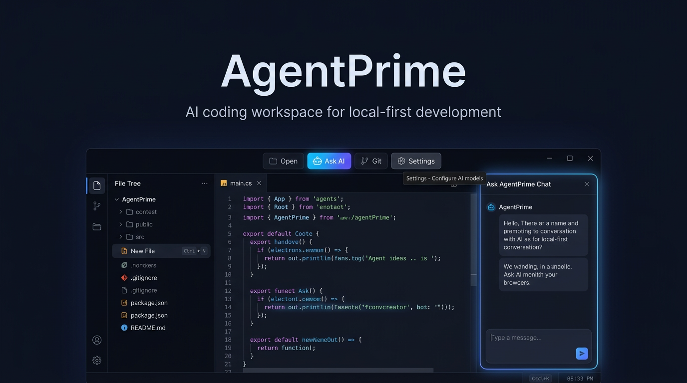

# AgentPrime

AgentPrime is an Electron-based AI coding workspace focused on local-first development. It combines a lightweight desktop IDE shell with multi-provider AI chat, workspace tools, file navigation, settings, templates, and Git-aware workflows.

## Why AgentPrime

- Local desktop app with a focused IDE-style interface
- AI chat and coding assistance inside the workspace
- Multi-provider model support including Anthropic, OpenAI, Ollama, and OpenRouter
- Lean core startup profile that avoids booting heavy optional subsystems by default
- Built with Electron, React, TypeScript, and Webpack

## Current Product Shape

The default app experience is intentionally narrow and practical:

- Editor and workspace navigation
- AI composer / chat workflow
- Settings and provider configuration
- Command palette and keyboard shortcuts
- Git panel and project actions
- Template-driven project creation

### Lean Core Profile

- Focused surface area: editor, file explorer, AI composer, settings, command palette, and Git panel
- No auto-boot heavy subsystems: optional automation, collaboration, and agent-control systems are not started at launch
- Faster startup path: fewer background services and IPC registrations in the default profile

## Quick Start

### Prerequisites

- Node.js 16+
- npm
- Git

### Install

```bash
git clone https://github.com/AaronGrace978/AgentPrime.git
cd AgentPrime
npm install
```

### Run

```bash
# Recommended: build and launch
npm run quick-start

# Or run the build steps manually
npm run build
npm run start:dev
```

## Core Capabilities

### AI Integration

- Multiple model providers
- Streaming chat responses
- Smart routing across available models
- Context-aware workspace assistance

### Coding Workspace

- File tree and project navigation
- Monaco-powered editor surface
- Command palette and keyboard shortcuts
- Settings-driven provider and UI configuration

### Developer Workflow

- Git integration in the interface
- Template gallery for fast project setup
- CLI entry point for agent flows
- Packaging support for Windows, macOS, and Linux

## Development Scripts

```bash
# Build
npm run build
npm run build:main
npm run build:renderer

# Development
npm run dev
npm run start:dev
npm run quick-start

# Testing
npm test
npm run test:watch
npm run test:coverage
npm run test:e2e

# Quality
npm run lint
npm run typecheck

# Distribution
npm run dist
npm run dist:win
npm run dist:mac
npm run dist:linux
```

## Project Structure

```text
AgentPrime/
├── src/
│   ├── main/        # Electron main process
│   ├── renderer/    # React UI
│   └── types/       # Shared type definitions
├── templates/       # Starter projects and templates
├── tests/           # Unit, integration, and e2e coverage
├── scripts/         # Build and utility scripts
└── dist/            # Build output
```

## Configuration

Configure model providers from the in-app settings panel.

Supported providers include:

- Ollama for local models
- Anthropic for Claude models
- OpenAI for GPT models
- OpenRouter for multi-model access

## Troubleshooting

### Build Issues

- Confirm Node.js 16+ is installed
- Reinstall dependencies with `npm install`
- Run `npm run typecheck` to catch TypeScript issues

### Runtime Issues

- Check the Electron console output for errors
- Verify provider keys and settings are configured
- Rebuild with `npm run build` and relaunch

## Contributing

1. Fork the repository
2. Create a branch: `git checkout -b feature/my-change`
3. Make your changes
4. Run relevant tests or checks
5. Commit and push your branch
6. Open a pull request

## License

This project is open source and available under the MIT License. See `LICENSE` for details.