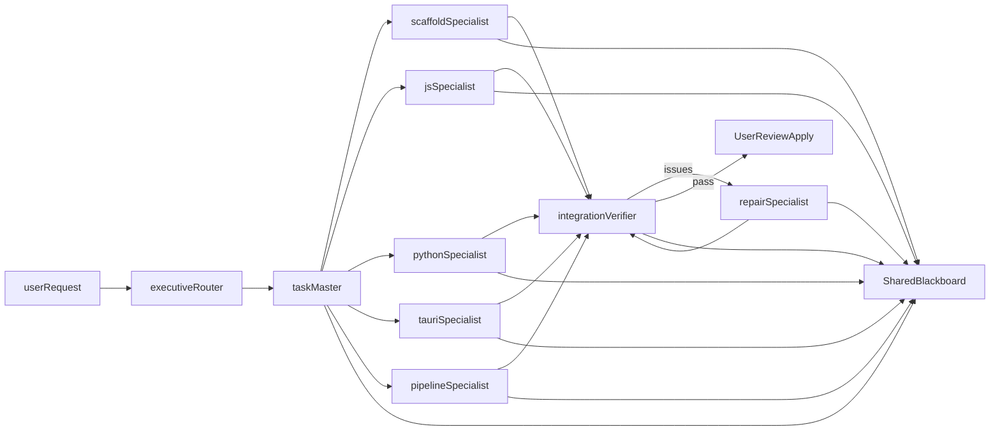

# Bounded Specialist Matrix

## Goal
Turn AgentPrime's current "specialized agents" into a stricter collaboration model where each agent is only allowed to do the work it actually specializes in.

Specialist here means a bounded expert in a domain or CS discipline, not just a language silo.

Examples:

- frontend application behavior
- backend services
- desktop runtime
- build and release
- verification
- repair

The current JS/Python/Tauri roles are a compatibility layer for the existing runtime, but the long-term model is discipline-first.

This is the target loop:

`create -> review -> apply -> install -> run -> repair`

The key rule is simple:

- planning agents do not write files
- implementation agents do not self-approve
- verification agents do not repair
- repair agents do not expand scope

## Why This Exists
Today, `src/main/agent/specialized-agents.ts` has role prompts, but the runtime still behaves more like a shared generalist system with different hats.

The missing pieces are:

- explicit file ownership
- explicit tool boundaries
- explicit handoff artifacts
- explicit escalation rules
- a shared blackboard for task state

Those are what make specialists real.

## Target Architecture

## Specialist Matrix
| Specialist | Core job | Can write? | Main file scope | Main limits |
| --- | --- | --- | --- | --- |
| `executive_router` | classify request and choose mode | no | read-only repo view | cannot write, run, or approve |
| `task_master` | plan work, assign owners, define acceptance criteria | no | read-only repo view | cannot patch code or run builds |
| `template_scaffold_specialist` | apply deterministic templates and baseline files | yes | `package.json`, `README.md`, `index.html`, `src/**`, `backend/**`, `src-tauri/**` | cannot repair or drift outside scaffold |
| `javascript_specialist` | own JS/TS/React/Node implementation | yes | `src/**/*.js`, `src/**/*.jsx`, `src/**/*.ts`, `src/**/*.tsx`, `tests/**/*.ts(x)` | cannot edit Python or pipeline policy |
| `python_specialist` | own backend and Python utilities | yes | `backend/**/*.py`, `scripts/**/*.py`, `tests/**/*.py` | cannot edit frontend or JS build config |
| `tauri_specialist` | own Rust/Tauri integration | yes | `src-tauri/**`, selected `src/**` desktop bridge files | cannot take over unrelated web app code |
| `pipeline_specialist` | own dependencies, scripts, config, CI | yes | `package.json`, lockfiles, `vite.config.*`, `tsconfig*.json`, workflow files | cannot rewrite product logic to fix feature bugs |
| `integration_verifier` | run bounded verification and produce findings | no | full repo read-only | cannot repair or silently change plan |
| `repair_specialist` | apply smallest fix for verifier findings | yes | only files named in repair plan | cannot re-scaffold or add new scope |

## Shared Blackboard
The blackboard is the system-of-record for each task.

It should contain:

- `taskId`
- `userGoal`
- `mode`
- `currentOwner`
- `status`
- `activeStepId`
- `claimedFiles` by specialist
- `steps` with acceptance criteria
- `artifacts`
- `verification findings`
- `approvalsRequired`

The typed shape for this is now in `src/main/agent/specialist-contracts.ts`.

Each specialist definition also carries a `reflectionFocus` list. That is where per-discipline reflective loops should come from.

Examples:

- frontend expert reflects on behavior, event wiring, and app-level correctness
- backend expert reflects on contracts, service logic, and failure handling
- pipeline expert reflects on reproducibility and cross-platform execution
- verifier reflects on evidence, not implementation
- repair expert reflects on minimum-force fixes

## Handoff Contracts
Each specialist should only consume and produce a small set of artifacts.

Examples:

- `executive_router` consumes `user_intent` and produces `execution_plan`
- `task_master` consumes `execution_plan` and produces step assignments plus acceptance criteria
- implementation specialists produce `file_patch_set`
- `integration_verifier` produces `verification_report`
- `repair_specialist` consumes `verification_report` and `repair_plan`

That means no specialist should have to infer the whole world from prompt text alone.

## Mapping From Current AgentPrime Roles
Current roles in `src/main/agent/specialized-agents.ts` should evolve like this:

| Current role | Target role |
| --- | --- |
| `tool_orchestrator` | `task_master` |
| `javascript_specialist` | `javascript_specialist` |
| `python_specialist` | `python_specialist` |
| `tauri_specialist` | `tauri_specialist` |
| `pipeline_specialist` | `pipeline_specialist` |
| `integration_analyst` | `integration_verifier` |

One new role is required:

- `executive_router`

One role should be split out from generic retry behavior:

- `repair_specialist`

One role should become explicit instead of implicit template fallback:

- `template_scaffold_specialist`

## Future Discipline Specialists
After the bounded-runtime core is stable, the next specialists should be domain experts such as:

- `styling_ux_specialist`
- `testing_specialist`
- `security_specialist`
- `data_contract_specialist`
- `performance_specialist`

Those should each get:

- explicit writable/readable scope
- their own reflection checklist
- their own acceptance criteria
- clear escalation rules to verifier or repair

## Enforcement Rules
Prompt wording alone is not enough. Boundaries should be enforced in code.

The runtime should reject work when:

- a specialist writes outside its allowed globs
- a specialist uses a forbidden tool
- a verifier attempts to patch files
- a repair pass touches files not named in the verifier findings
- a pipeline specialist starts feature work
- a scaffold specialist rewrites an already accepted implementation area

The natural enforcement points in AgentPrime are:

- `src/main/agent/tool-validation.ts`
- `src/main/agent/task-master.ts`
- `src/main/agent/specialized-agents.ts`
- `src/main/agent/specialized-agent-loop.ts`

## Recommended Flow In AgentPrime
1. Add `executive_router` before the current specialist loop so requests are classified into `talk`, `create`, `edit`, `verify`, or `repair`.
2. Promote `task-master.ts` from review helper into the actual owner of planning, file claims, and acceptance criteria.
3. Convert deterministic template bootstrap into `template_scaffold_specialist` behavior instead of an implicit side path.
4. Replace the current `integration_analyst` role with `integration_verifier` semantics: read-only, verification-first, findings out.
5. Add `repair_specialist` as the only role allowed to act on verifier findings after a failed run.
6. Keep user-visible review checkpoints between `file_patch_set`, `install/run`, and `repair`.

## What This Fixes
This model directly addresses the problems that make the current system feel alpha:

- too much authority in a single run
- weak ownership of files
- silent tool-skips and unclear handoffs
- retries that re-open the entire problem instead of fixing the actual failure
- specialists that are mostly different prompts instead of different responsibilities

## Rollout Order
Implement this in layers:

1. Define and store specialist contracts in code.
2. Add blackboard state to `specialized-agent-loop.ts`.
3. Make `task-master.ts` claim files and issue assignments.
4. Enforce specialist file/tool boundaries in `tool-validation.ts`.
5. Split verifier and repair behavior in `specialized-agents.ts`.
6. Add UI review/apply checkpoints around patch sets and verification findings.

## Current Source Of Truth
The initial typed contract source of truth now lives in:

- `src/main/agent/specialist-contracts.ts`

This file should drive future routing, validation, and blackboard enforcement rather than letting role boundaries drift inside prompt strings.
